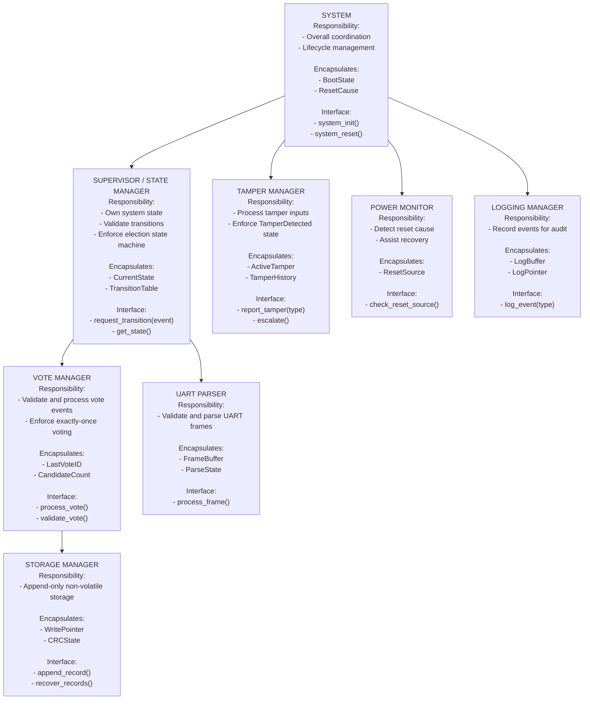

# Architecture

# Hierarchy of Control Diagram

---

# Dependency Constraints

Allowed:

* Parser → Supervisor
* Supervisor → VoteMgr
* Supervisor → Tamper
* VoteMgr → Storage
* Power → Supervisor
* All modules → Logger (one-way logging only)

Forbidden:

* Storage calling upward
* Logger influencing control
* Tamper depending on Parser
* VoteMgr directly accessing UART
* Shared mutable global variables

Global State Policy:

* Only Supervisor owns `CurrentState`
* No shared mutable globals between modules

---

# Behavioral Mapping

| Module     | Related States                                                          | Related Transitions      | Related Sequence Diagrams |
| ---------- | ----------------------------------------------------------------------- | ------------------------ | ------------------------- |
| Supervisor | Initialization, PreElection, VotingActive, VotingClosed, TamperDetected | All                      | All                       |
| Tamper     | TamperDetected                                                          | CaseOpen, VoltageAnomaly | Tamper Handling           |
| VoteMgr    | VotingActive                                                            | VoteReceived             | Voting Flow               |
| Parser     | None (observer)                                                         | FrameValidated           | Input Processing          |
| Storage    | All (recovery context)                                                  | RecoveryOnBoot           | Power Loss                |
| Power      | Initialization                                                          | BootRecovery             | Reset Handling            |
| Logger     | All                                                                     | Logging only             | All                       |

---

# Interaction Summary

| Module     | Calls           | Called By     | Shared Data? |
| ---------- | --------------- | ------------- | ------------ |
| Supervisor | VoteMgr, Tamper | Parser, Power | No           |
| Tamper     | Supervisor      | Supervisor    | No           |
| VoteMgr    | Storage         | Supervisor    | No           |
| Parser     | Supervisor      | UART ISR      | No           |
| Storage    | None            | VoteMgr       | No           |
| Logger     | None            | All           | No           |
| Power      | Supervisor      | System        | No           |

---

# Architectural Rationale

### Organizational Style: Coordinated Controllers with Security Override

The architecture follows a coordinated controller model:

* A central Supervisor / State Manager owns system state.
* Functional modules (Vote Manager, Parser) coordinate through it.
* Tamper logic exists as a parallel supervisory component capable of overriding operation.

System control authority resides in: **Supervisor / State Manager**
System state is owned by: **Supervisor / State Manager**

Tamper logic is separated from normal voting flow so that security violations override operation without depending on input parsing or logging.

The architecture emphasizes:

* Deterministic behavior
* Append-only storage
* Minimal coupling
* Fail-safe defaults
* Auditability

---

# Task Split

| Member | Module(s) Owned         |
| ------ | ----------------------- |
| A      | Supervisor              |
| B      | UART Parser             |
| C      | Vote Manager            |
| D      | Storage + Power Monitor |
| E      | Tamper Manager + Logger |

---

# Individual Module Specification

---

## Module: Supervisor

### Purpose and Responsibilities

Maintain election state and enforce valid transitions.

### Inputs

* Events from Parser
* Tamper events
* Power recovery events

### Outputs

* Calls to VoteMgr
* Transition to TamperDetected
* State updates

### Internal State

* CurrentState
* TransitionTable

### Initialization / Deinitialization

* Init: Enter PreElection
* Reset: Restore state from storage or enter TamperDetected

### Basic Protection Rules

* Reject votes outside VotingActive
* TamperDetected is irreversible
* Invalid transitions are logged

### Module-Level Tests

| Test ID | Purpose                    | Stimulus                 | Expected Outcome |
| ------- | -------------------------- | ------------------------ | ---------------- |
| T-S1    | Reject vote in PreElection | Vote event               | Rejected         |
| T-S2    | Valid state transition     | PreElection→VotingActive | Accepted         |

---

## Module: Vote Manager

### Purpose and Responsibilities

Process and validate vote events; ensure exactly-once semantics.

### Inputs

* Vote events from Supervisor

### Outputs

* append_record() to Storage

### Internal State

* LastVoteID
* CandidateCount

### Initialization / Deinitialization

* Init: Reset LastVoteID
* Reset: Recovered from Storage

### Basic Protection Rules

* Reject duplicate vote IDs
* Validate candidate range
* Reject votes if not in VotingActive

### Module-Level Tests

| Test ID | Purpose        | Stimulus    | Expected Outcome |
| ------- | -------------- | ----------- | ---------------- |
| T-V1    | Duplicate vote | Same VoteID | Ignored          |
| T-V2    | Valid vote     | New VoteID  | Stored           |

---

## Module: UART Parser

### Purpose and Responsibilities

Validate and parse incoming UART frames.

### Inputs

* Raw UART frames

### Outputs

* Structured events to Supervisor

### Internal State

* FrameBuffer
* ParseState

### Initialization / Deinitialization

* Init: Clear buffer
* Reset: Clear partial frames

### Basic Protection Rules

* Reject malformed frames
* Reject unknown commands
* Log parsing errors

### Module-Level Tests

| Test ID | Purpose           | Stimulus      | Expected Outcome |
| ------- | ----------------- | ------------- | ---------------- |
| T-P1    | Missing delimiter | Invalid frame | Discarded        |
| T-P2    | Valid vote frame  | Proper frame  | Forwarded        |

---

## Module: Storage Manager

### Purpose and Responsibilities

Append-only non-volatile vote storage.

### Inputs

* Valid vote records

### Outputs

* Persistent storage update

### Internal State

* WritePointer
* CRCState

### Initialization / Deinitialization

* Init: Scan NVM and validate records
* Reset: Recover last valid pointer

### Basic Protection Rules

* Never overwrite records
* Validate CRC on boot
* Stop at first incomplete record

### Module-Level Tests

| Test ID | Purpose                 | Stimulus | Expected Outcome  |
| ------- | ----------------------- | -------- | ----------------- |
| T-ST1   | Power loss during write | Reboot   | No corrupted vote |
| T-ST2   | CRC failure             | Boot     | Stop recovery     |

---

## Module: Tamper Manager

### Purpose and Responsibilities

Detect and escalate tamper events.

### Inputs

* Tamper signals

### Outputs

* Force transition to TamperDetected

### Internal State

* ActiveTamper
* TamperHistory

### Initialization / Deinitialization

* Init: Clear transient flags
* Reset: Preserve tamper history

### Basic Protection Rules

* Critical tamper immediately locks system
* TamperDetected irreversible

### Module-Level Tests

| Test ID | Purpose   | Stimulus | Expected Outcome |
| ------- | --------- | -------- | ---------------- |
| T-T1    | Case open | Event    | Lock system      |

---

# Architectural Risk

### Identified Risk

Vote Manager and Storage Manager may become tightly coupled if storage format details leak upward.

### Mitigation

Introduce a strict storage API boundary and prevent Vote Manager from accessing raw memory structures.

---

