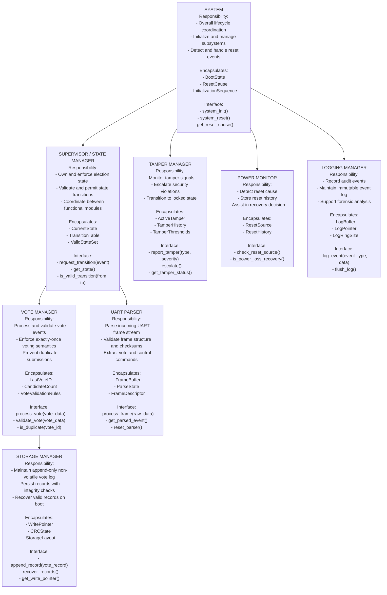

# Lab 4: Firmware Architecture Design
## Election Voting System with Tamper Detection

> **Course:** CS G523 – Software for Embedded Systems  
> **Team Size:** 3 members  
> **Submission Type:** Group document with individual module ownership  
> **Objective:** Secure election voting appliance with tamper detection and append-only storage

---

## Step 1 – Exploratory Block Sketch

**Preliminary Blocks Identified:**

1. **Input Reception** – UART frame parsing
2. **State Management** – Election state machine
3. **Vote Processing** – Validation and deduplication
4. **Security Monitoring** – Tamper detection
5. **Persistent Storage** – Append-only vote log
6. **System Lifecycle** – Initialization, recovery, reset
7. **Audit Logging** – Event recording
8. **Power Management** – Reset cause detection

**Rough Relationships:**
- UART frames → Parser → Supervisor
- Supervisor → Vote Manager → Storage
- Tamper signals → Tamper Manager → Supervisor (override)
- All modules → Logger (audit only)
- System initializes all modules and monitors Power

---

## Step 2 – Hierarchy of Control Diagram



---

## Step 3 – Dependency Constraints

### Allowed Dependencies

- `Parser` → `Supervisor` (events only)
- `Supervisor` → `Vote Manager` (vote requests)
- `Supervisor` → `Tamper Manager` (status queries)
- `Vote Manager` → `Storage` (persistence)
- `Power Monitor` → `Supervisor` (initialization hints)
- **All modules** → `Logger` (one-way audit logging only)

### Forbidden Dependencies

- `Storage` calling upward to `Vote Manager` or `Supervisor`
- `Logger` influencing any control decision
- `Tamper Manager` depending on `Parser` or `Vote Manager` output
- `Vote Manager` directly accessing UART or hardware
- Shared mutable global variables between modules
- Circular dependencies of any form

### Global State Policy

- **Only `Supervisor`** owns `CurrentState` and `TransitionTable`
- **Only `Storage`** owns `WritePointer` and persistent vote records
- **Only `Tamper Manager`** owns `ActiveTamper` state
- No module directly modifies another module's state
- All state changes communicated via function calls or events

---

## Step 4 – Behavioral Mapping Table

| Module | Related States | Related Transitions | Related Sequence Diagrams |
|--------|---------------|--------------------|---------------------------|
| **Supervisor** | Initialization, PreElection, VotingActive, VotingClosed, TamperDetected, Error | All state transitions in system | Init Flow, Normal Voting, Recovery, Tamper Escalation |
| **Tamper Manager** | TamperDetected | CaseOpen, VoltageAnomaly, MemoryTamper | Tamper Detection, Emergency Lockdown |
| **Vote Manager** | VotingActive | VoteReceived, DuplicateDetected | Vote Processing, Validation |
| **Parser** | None (observer) | FrameValidated, FrameRejected | Input Processing, Error Handling |
| **Storage** | All states (recovery context) | RecoveryOnBoot, RecordAppended | Power Loss Recovery, Storage Validation |
| **Power Monitor** | Initialization | BootRecovery, PowerLossDetected | System Start, Recovery Decision |
| **Logger** | All states | LogWrite | All sequences (audit trail) |

---

## Step 5 – Interaction Summary

| Module | Calls | Called By | Shared Data? |
|--------|-------|----------|-------------|
| **Supervisor** | VoteMgr, TamperMgr, Parser | Power, Tamper, Parser | No |
| **Tamper Manager** | Supervisor | Hardware ISR, Monitoring Loop | No |
| **Vote Manager** | Storage | Supervisor | No |
| **Parser** | Supervisor | UART ISR | No |
| **Storage** | None | Vote Manager | No |
| **Power Monitor** | Supervisor | System, Clock ISR | No |
| **Logger** | None | All modules | No (write-only) |

**Coupling Analysis:**
- Low coupling overall; all module interactions flow through `Supervisor`
- `Tamper Manager` → `Supervisor` is unidirectional (escalation only)
- `Storage` has minimal coupling (called only by `Vote Manager`)

---

## Step 6 – Architectural Rationale

### Organizational Style: Coordinated Controllers with Security Override

This architecture follows a **coordinated controller** pattern:

1. **Central Authority:** `Supervisor / State Manager` owns all election state and coordinates transitions
2. **Functional Modules:** `Vote Manager` and `Parser` perform specialized tasks and request state changes
3. **Security Override:** `Tamper Manager` operates in parallel and can escalate violations without consulting normal flow
4. **Persistence:** `Storage Manager` provides durable record keeping independent of control flow
5. **Auditing:** `Logger` records all significant events for forensic analysis

### Key Design Principles

| Principle | Implementation |
|-----------|-----------------|
| **Single Responsibility** | Each module has one clear purpose |
| **Separation of Concerns** | Security logic isolated from voting logic |
| **Deterministic Behavior** | State machine with explicit transition rules |
| **Append-Only Storage** | No vote can be modified or deleted |
| **Fail-Safe Defaults** | Power loss → Safe_Stop; Tamper → Locked |
| **Minimal Coupling** | Coordinator pattern reduces cross-module dependencies |
| **Auditability** | Every significant action logged |

### Authority and State Ownership

- **System control authority resides in:** `Supervisor / State Manager`
- **System state is owned by:** `Supervisor / State Manager`
- **Security overrides by:** `Tamper Manager` (forces transition to `TamperDetected`)

### Why This Architecture?

- **Tamper isolation:** Security violations can lock the system without depending on input parsing or logging
- **Vote integrity:** `Exactly-once semantics` enforced by `Vote Manager` + deduplication + storage
- **Recovery:** `Power Monitor` and `Storage` enable boot-time recovery
- **Auditability:** Immutable log supports post-election audit and forensic analysis

---

## Step 7 – Task Split

| Member | Module(s) Owned | Responsible For |
|--------|------------------|-----------------|
| **Gagan** | Supervisor + System | State machine, transitions, coordination logic, initialization |
| **Jenil** | Parser + Power Monitor + Storage | UART parsing, frame validation, reset detection, , persistent storage |
| **Saunak** | Vote Manager + Tamper Manager + Logger | Vote validation, security, audit trail |

**Rationale for 3-person split:**
- **Gagan:** Core state management (most complex)
- **Jenil:** Input and low-level monitoring (hardware-close)
- **Saunak:** Business logic + security + persistence (volume of small modules)

---

## Step 8 – Individual Module Specifications

---

## Module: Supervisor / State Manager

### Purpose and Responsibilities

Maintain the election state machine and enforce valid state transitions. Coordinate all functional modules through a single point of control.

### Inputs

- **Events from Parser:** Frame-parsed vote or control commands
- **Tamper events:** From Tamper Manager (high priority)
- **Power recovery hints:** From Power Monitor
- **Status queries:** From Vote Manager (can transition?)

### Outputs

- **Transition requests:** To Vote Manager (`process_vote()`)
- **State change notifications:** To all modules via callbacks
- **Query responses:** Current state to any caller

### Internal State

```c
typedef enum {
    STATE_INITIALIZATION,
    STATE_PRE_ELECTION,
    STATE_VOTING_ACTIVE,
    STATE_VOTING_CLOSED,
    STATE_TAMPER_DETECTED,
    STATE_ERROR
} ElectionState;

typedef struct {
    ElectionState current_state;
    ElectionState previous_state;
    uint32_t transition_count;
    uint32_t last_transition_time;
} SupervisorState;
```

- **CurrentState:** Enum value from `{Initialization, PreElection, VotingActive, VotingClosed, TamperDetected, Error}`
- **TransitionTable:** 2D array `[from_state][event] → to_state`
- **History:** Previous state and timestamp for debugging

### Initialization / Deinitialization

- **Init:** 
  - Query `Power Monitor` for reset cause
  - If cold boot → enter `PreElection`
  - If recovery boot → enter `PreElection` (vote list restored by Storage on demand)
  - If tamper detected → enter `TamperDetected`
  
- **Reset:** 
  - Transition to `TamperDetected` state (fail-safe)
  
- **Shutdown:** 
  - Log final state
  - Signal all modules to cease operations

### Basic Protection Rules

- **Reject invalid transitions:** If `current_state` + `event` not in `TransitionTable`, log and ignore
- **Enforce one-way to `TamperDetected`:** Once entered, cannot leave
- **Enforce `VotingActive` precondition:** Vote Manager only processes votes if Supervisor confirms `VotingActive` state
- **Log all violations:** Invalid transitions and tamper escalations logged
- **Prevent concurrent transitions:** Use simple flag/semaphore to ensure atomic state change

### Module-Level Tests

| Test ID | Purpose | Stimulus | Expected Outcome |
|---------|---------|----------|------------------|
| T-SV-1 | Reject vote in PreElection | Vote event in PreElection state | Event rejected, state unchanged |
| T-SV-2 | Valid transition | PreElection → VotingActive | State updated, transition logged |
| T-SV-3 | Invalid transition blocked | VotingClosed → VotingActive | Rejected, logged as error |
| T-SV-4 | Tamper escalation | TamperDetected event | Immediate transition to TamperDetected, irreversible |
| T-SV-5 | Recovery after power loss | Power loss + reboot + recovery | Re-enter PreElection, Storage restores vote count |

---

## Module: Parser (UART)

### Purpose and Responsibilities

Receive and parse raw UART frame stream; extract and validate vote and command events; forward validated events to Supervisor.

### Inputs

- **Raw UART bytes:** From UART ISR (interrupt-driven stream)
- **Frame delimiters:** Protocol-defined start/end markers
- **Checksums:** CRC or simple checksum in frame

### Outputs

- **Parsed events:** To Supervisor (`request_transition()` calls)
- **Error notifications:** Invalid frames logged, dropped
- **Status:** Frame buffer state available on query

### Internal State

```c
typedef struct {
    uint8_t frame_buffer[FRAME_MAX_SIZE];
    uint16_t buffer_index;
    ParseState parse_state;  // { IDLE, IN_FRAME, CHECKSUM, COMPLETE }
    uint32_t frame_count;
    uint32_t error_count;
} ParserState;
```

- **FrameBuffer:** Circular or linear buffer for partial frames
- **ParseState:** State machine: `IDLE` → `IN_FRAME` → `CHECKSUM` → `COMPLETE` → `IDLE`
- **Statistics:** Frames received, errors, valid commands

### Initialization / Deinitialization

- **Init:** Clear buffer, set `ParseState = IDLE`, reset counters
- **Reset:** Discard partial frame, return to `IDLE`
- **Shutdown:** Flush any pending data, log final statistics

### Basic Protection Rules

- **Reject malformed frames:** Missing start/end delimiter → discard
- **Validate checksum:** CRC mismatch → reject, count error
- **Reject oversized frames:** Frame length exceeds `FRAME_MAX_SIZE` → discard
- **Reject unknown commands:** Command opcode not in whitelist → reject with error log
- **Rate limiting:** If error count exceeds threshold in time window, escalate to Supervisor as potential attack
- **Timeout:** If frame incomplete after timeout, discard and reset

### Module-Level Tests

| Test ID | Purpose | Stimulus | Expected Outcome |
|---------|---------|----------|------------------|
| T-PA-1 | Missing frame delimiter | Bytes without frame markers | Discarded, error logged |
| T-PA-2 | Valid vote frame | Well-formed vote frame with correct checksum | Forwarded to Supervisor |
| T-PA-3 | Corrupted checksum | Frame with invalid CRC | Rejected, error count incremented |
| T-PA-4 | Oversized frame | Frame exceeding max size | Truncated or rejected |
| T-PA-5 | Unknown command | Command opcode not in whitelist | Logged as error, not forwarded |

---

## Module: Power Monitor

### Purpose and Responsibilities

Detect system reset cause (power loss, watchdog, software reset, etc.); assist Supervisor in recovery decision-making.

### Inputs

- **Hardware reset signals:** From SoC reset controller (read registers)
- **Power supply status:** Brown-out detection, low-battery flags
- **RTC:** For timestamp correlation

### Outputs

- **Reset cause report:** To Supervisor at boot
- **Recovery hints:** Suggestion on whether to recover from Storage or cold-start

### Internal State

```c
typedef enum {
    RESET_COLD_BOOT,
    RESET_POWER_LOSS,
    RESET_WATCHDOG,
    RESET_SOFTWARE,
    RESET_UNKNOWN
} ResetCause;

typedef struct {
    ResetCause last_reset_cause;
    uint32_t reset_count;
    uint32_t last_reset_time;
} PowerMonitorState;
```

- **ResetSource:** Enum identifying the reset cause
- **ResetHistory:** Count and timestamp of last reset

### Initialization / Deinitialization

- **Init (at boot):**
  - Read SoC reset controller registers
  - Determine `ResetCause`
  - Report to `Supervisor` via `check_reset_source()`
  
- **Reset:** N/A (no graceful shutdown for Power Monitor)

### Basic Protection Rules

- **Validate reset registers:** Multiple reads to confirm stable reset source
- **Distinguish power loss from watchdog:** Power loss → recover storage; watchdog → suspect corruption
- **Log reset events:** Every reset logged with cause and timestamp
- **Watchdog reset → escalate:** Treat as potential error condition, suggest Supervisor enter Error state

### Module-Level Tests

| Test ID | Purpose | Stimulus | Expected Outcome |
|---------|---------|----------|------------------|
| T-PM-1 | Detect cold boot | SoC POR flag set | Returns RESET_COLD_BOOT |
| T-PM-2 | Detect power loss | VBAT low during operation → reboot | Returns RESET_POWER_LOSS, Storage recovery hint |
| T-PM-3 | Detect watchdog reset | Watchdog timer expired | Returns RESET_WATCHDOG, suspect state corruption |
| T-PM-4 | Multiple resets | Rapid resets in sequence | Count incremented, escalated if threshold exceeded |

---

## Module: Vote Manager

### Purpose and Responsibilities

Process and validate vote events received from Supervisor; enforce exactly-once voting semantics; detect and reject duplicate submissions.

### Inputs

- **Vote events:** From Supervisor (only called if in `VotingActive` state)
- **Candidate list:** Initial configuration
- **Vote ID:** Unique identifier from voter

### Outputs

- **Storage write request:** `append_record()` to Storage Manager
- **Validation result:** Accept or reject (with reason)

### Internal State

```c
typedef struct {
    uint32_t last_vote_id;
    uint32_t candidate_count;
    uint32_t votes_processed;
    uint32_t duplicates_rejected;
} VoteManagerState;
```

- **LastVoteID:** Most recent vote ID successfully processed (for duplicate detection)
- **CandidateCount:** Number of valid candidates
- **Vote validation rules:** Candidate range, vote format

### Initialization / Deinitialization

- **Init:** 
  - Load candidate count
  - Reset `LastVoteID` to 0
  - Counters to 0
  
- **Reset (recovery boot):**
  - Query `Storage` for highest vote ID already recorded
  - Set `LastVoteID` to that value
  - Resume processing
  
- **Shutdown:** Log final vote count

### Basic Protection Rules

- **Duplicate detection:** If `vote_id ≤ LastVoteID`, reject as duplicate
- **Candidate range validation:** `0 ≤ candidate_id < CandidateCount`
- **Vote format validation:** Required fields present and non-null
- **Rate limiting:** Reject burst of votes in short time (potential attack)
- **Escalation:** Repeated validation failures → log as anomaly, possible alert

### Module-Level Tests

| Test ID | Purpose | Stimulus | Expected Outcome |
|---------|---------|----------|------------------|
| T-VM-1 | Duplicate vote rejection | Same VoteID submitted twice | Second rejected, first recorded |
| T-VM-2 | Valid vote acceptance | New VoteID, valid candidate | Forwarded to Storage |
| T-VM-3 | Invalid candidate range | Candidate ID ≥ CandidateCount | Rejected, error logged |
| T-VM-4 | Malformed vote | Missing required fields | Rejected before Storage |
| T-VM-5 | Recovery from storage | Boot after power loss | LastVoteID correctly restored from Storage |

---

## Module: Storage Manager

### Purpose and Responsibilities

Maintain append-only non-volatile storage of vote records; validate integrity with CRC; support recovery of valid records on boot.

### Inputs

- **Vote records:** From Vote Manager (complete, validated)
- **Storage address range:** From hardware configuration
- **Power state:** Notifications of power-loss risk

### Outputs

- **Persistence guarantee:** Vote written to NVM
- **Recovery data:** At boot, return all valid votes previously stored
- **Integrity status:** CRC validation results

### Internal State

```c
typedef struct {
    uint32_t write_pointer;
    uint32_t crc_state;
    uint32_t records_stored;
    uint32_t records_recovered;
} StorageState;
```

- **WritePointer:** Current address in NVM for next write
- **CRCState:** Running CRC of all records written
- **Layout:** Fixed regions, no compaction

### Initialization / Deinitialization

- **Init (at boot):**
  - Scan NVM from start address
  - Validate each record's CRC
  - Stop at first invalid/incomplete record
  - Set `WritePointer` to next available address
  - Report count of recovered records to `Vote Manager`
  
- **Reset:** N/A (storage is persistent)

### Basic Protection Rules

- **Append-only:** Never overwrite existing records
- **CRC validation:** Every record includes CRC; validate on write and read
- **Incomplete record detection:** If write interrupted, incomplete record is skipped and next valid record sought
- **Wear leveling consideration:** Plan for future flash wear (if applicable)
- **Full NVM handling:** When storage full, reject further votes with clear error

### Module-Level Tests

| Test ID | Purpose | Stimulus | Expected Outcome |
|---------|---------|----------|------------------|
| T-ST-1 | Power loss during write | Reboot mid-write | Incomplete record skipped, next write starts fresh |
| T-ST-2 | CRC failure on boot | Corrupted record in NVM | Record skipped, recovery continues |
| T-ST-3 | Append new record | Valid vote received | Write pointer advanced, CRC updated |
| T-ST-4 | Recovery restores lastVoteID | Boot after power loss | Highest vote ID fetched, passed to Vote Manager |
| T-ST-5 | NVM full condition | Storage exhausted | New votes rejected, error signaled |

---
