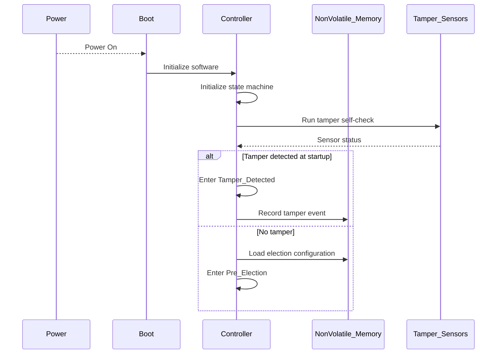
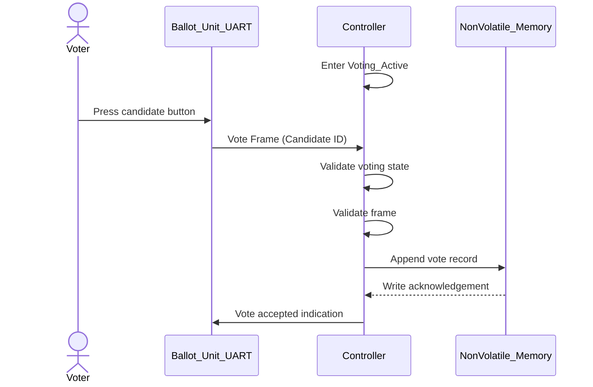
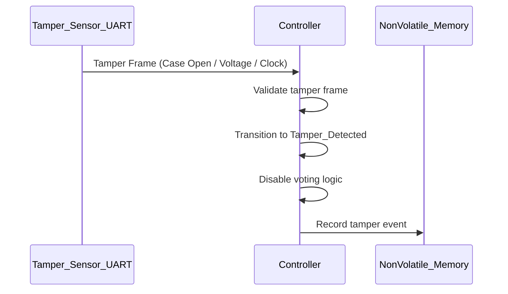
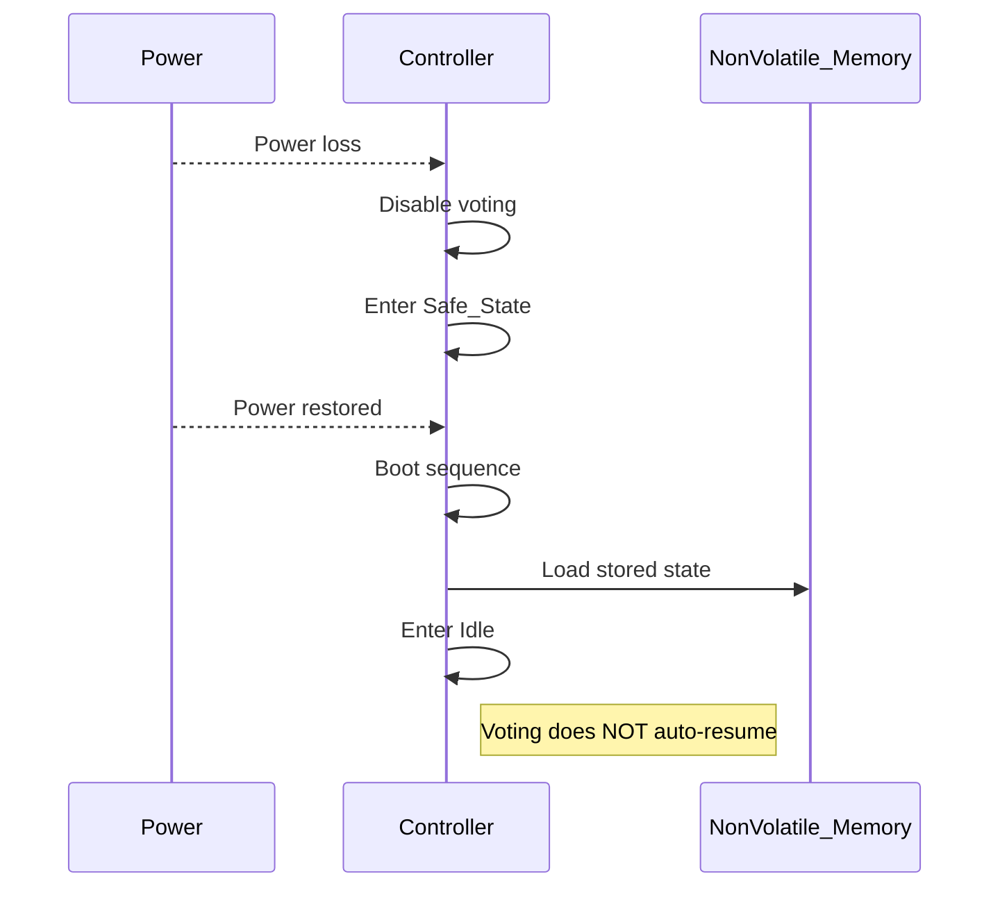

---

# Lab 3 – Individual Worksheet: V-Model and Traceability

## 1. Key Sequence Diagrams

---

### SD-1: System Start-up and Initialization

---

### SD-2: Normal Voting (Sunny Day)

---

### SD-3: Safety-Critical – Tamper Detection

---

### SD-4: Recovery After Power Loss / Reset

---

## 2. Traceability Matrix

| Requirement                            | State(s)        | Sequence Diagram(s) | Test ID |
| -------------------------------------- | --------------- | ------------------- | ------- |
| R-V1 Record vote exactly once          | Voting_Active   | SD-2                | T-1     |
| R-V2 Accept votes only in voting state | Voting_Active   | SD-2                | T-2     |
| R-S1 Detect tamper                     | Tamper_Detected | SD-1, SD-3          | T-3     |
| R-S2 Disable voting on tamper          | Tamper_Detected | SD-3                | T-4     |
| R-P1 Preserve votes on power loss      | Safe_State      | SD-4                | T-5     |
| R-P2 No auto-resume after reset        | Idle            | SD-4                | T-6     |

---

## 3. Test Plan

The tests are **design-level** and independent of hardware implementation.

---

## T-1: Vote Recording Exactly Once

**Related Requirements**

* R-V1: Record each vote exactly once

**Purpose**
Verify that a vote is stored exactly once even if duplicate frames occur.

**Preconditions**

* System in `Voting_Active`
* NVM initialized

**Stimulus**

* Send valid vote UART frame
* Send duplicate vote frame

**Expected Outcome**

* Only one vote record stored

**Pass/Fail Criteria**

* PASS if exactly one vote is recorded
* FAIL if duplicate votes are stored

---

## T-2: Reject Votes Outside Voting State

**Related Requirements**

* R-V2: Accept votes only in voting state

**Purpose**
Ensure votes are ignored outside authorized states.

**Preconditions**

* System in `Idle` or `Voting_Closed`

**Stimulus**

* Send vote UART frame

**Expected Outcome**

* Vote is rejected
* No NVM modification

**Pass/Fail Criteria**

* PASS if no vote is stored
* FAIL if vote is recorded

---

## T-3: Tamper Detection

**Related Requirements**

* R-S1: Detect tamper events

**Purpose**
Verify tamper frames are detected and acted upon.

**Preconditions**

* System operational

**Stimulus**

* Inject tamper UART frame

**Expected Outcome**

* System transitions to `Tamper_Detected`
* Tamper event logged

**Pass/Fail Criteria**

* PASS if state transition and logging occur
* FAIL otherwise

---

## T-4: Disable Voting After Tamper

**Related Requirements**

* R-S2: Disable voting after tamper

**Purpose**
Ensure no votes are accepted after tamper detection.

**Preconditions**

* System in `Tamper_Detected`

**Stimulus**

* Send vote UART frame

**Expected Outcome**

* Vote ignored

**Pass/Fail Criteria**

* PASS if vote is rejected
* FAIL if vote is accepted

---

## T-5: Power Loss Handling

**Related Requirements**

* R-P1: Preserve votes on power loss

**Purpose**
Verify votes are not lost on power failure.

**Preconditions**

* Votes already recorded

**Stimulus**

* Abrupt power loss and restore

**Expected Outcome**

* Votes remain intact after reboot

**Pass/Fail Criteria**

* PASS if all votes are preserved
* FAIL if votes are lost or corrupted

---

## T-6: No Auto-Resume After Reset

**Related Requirements**

* R-P2: No automatic voting after reset

**Purpose**
Ensure explicit election start is required.

**Preconditions**

* System reset after voting

**Stimulus**

* Restore power without election start command

**Expected Outcome**

* System remains in `Idle`

**Pass/Fail Criteria**

* PASS if voting does not resume
* FAIL if voting resumes automatically

---

## 4. Gap and Risk Analysis

* Tamper detection depends on correctness of UART sensor frames
* Delayed tamper frames could allow a small acceptance window
* NVM corruption handling requires further fault-injection testing

---

