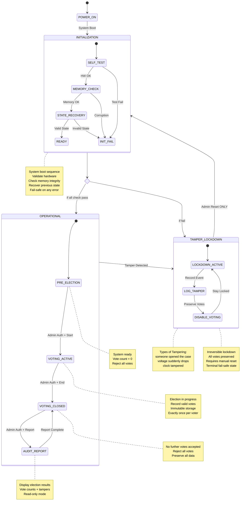

## Use Cases

| Use Case ID | Use Case Name | Primary Actor | Brief Description |
|-------------|---------------|---------------|-------------------|
| UC-1        |Cast Vote      |Voter          |When the election is active, a voter selects a candidate. The system validates the input, records the vote exactly once, and confirms successful recording. If the election is not active or a tamper condition exists, the vote is rejected.                   |
| UC-2        |Detect Tamper Event     |  Tamper Sensor             |   When a tamper sensor signals an abnormal condition, the system detects the event, transitions to a tamper-detected state, disables further voting, and preserves all recorded votes.                |
| UC-3        |Generate Election Report               |Election Official               |After voting is closed, the election official requests the final report. The system generates a summary of recorded votes. If voting is still active, report generation is denied.                   |

---

